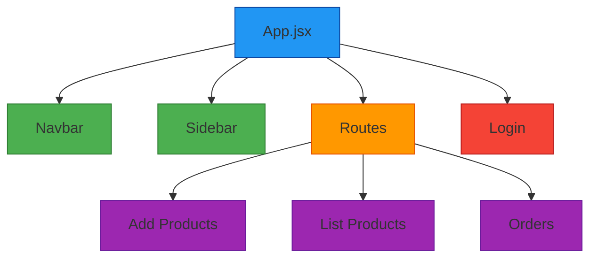
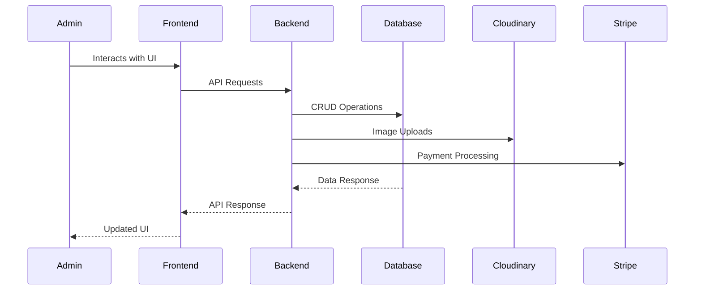

# 🛠️ Admin Dashboard - Trendify E-Commerce

<div align="center">
  


</div>

<div align="center">
  
</div>

<p align="center">Admin dashboard for the Trendify e-commerce platform built with React, Vite, and Tailwind CSS.</p>

---

## 📋 Overview

The Admin Dashboard is a comprehensive management interface that allows administrators to control all aspects of the e-commerce platform. It provides tools for product management, order processing, and analytics.

<div align="center">
  
</div>

---

## 🏗️ Architecture

### Component Structure



### Data Flow



---

## 🚀 Key Features

### 🔧 Product Management
- **Add Products**: Create new products with images, pricing, and categorization
- **Edit Products**: Update existing product information
- **Remove Products**: Delete products from the catalog
- **Product Listing**: View all products in a sortable table

### 📦 Order Management
- **Order Tracking**: View all customer orders
- **Order Status Updates**: Update order fulfillment status
- **Order Details**: Access detailed order information

### 👥 User Management
- **Access Control**: Role-based permissions
- **User Accounts**: Manage customer accounts

---

## 🛠️ Tech Stack

| Technology | Purpose |
|------------|---------|
| **React** | Frontend library for building UI components |
| **Vite** | Build tool for fast development and production builds |
| **Tailwind CSS** | Utility-first CSS framework for styling |
| **React Router** | Navigation and routing |
| **Axios** | HTTP client for API requests |

---

## 📁 Project Structure

```
admin/
├── src/
│   ├── assets/          # Images and static assets
│   ├── components/      # Reusable UI components
│   │   ├── Login.jsx    # Authentication component
│   │   ├── Navbar.jsx   # Top navigation bar
│   │   └── Sidebar.jsx  # Side navigation menu
│   ├── pages/           # Main page components
│   │   ├── Add.jsx      # Add products page
│   │   ├── List.jsx     # List products page
│   │   └── Orders.jsx   # View orders page
│   ├── App.jsx          # Main application component
│   ├── main.jsx         # Entry point
│   └── index.css        # Global styles
├── public/              # Static assets
├── index.html           # HTML template
├── package.json         # Dependencies and scripts
└── vite.config.js       # Vite configuration
```

---

## ▶️ Getting Started

### Prerequisites
- Node.js (v16 or higher)
- npm or yarn

### Installation

```bash
# Navigate to admin directory
cd admin

# Install dependencies
npm install
```

### Development

```bash
# Start development server
npm run dev
# Runs on http://localhost:5174
```

### Production Build

```bash
# Create production build
npm run build

# Preview production build
npm run preview
```

---

## 🌐 Environment Variables

Create a `.env` file in the admin directory:

```env
VITE_BACKEND_URL=http://localhost:4000
```

---

## 🔄 API Integration

The admin dashboard communicates with the backend API for all data operations:

| Endpoint | Method | Purpose |
|----------|--------|---------|
| `/api/product/add` | POST | Add new products |
| `/api/product/list` | GET | Retrieve all products |
| `/api/product/remove` | DELETE | Remove products |
| `/api/order/list` | GET | Retrieve all orders |
| `/api/user/login` | POST | Admin authentication |

---

## 🤝 Contributing

1. Fork the repository
2. Create your feature branch (`git checkout -b feature/AmazingFeature`)
3. Commit your changes (`git commit -m 'Add some AmazingFeature'`)
4. Push to the branch (`git push origin feature/AmazingFeature`)
5. Open a Pull Request

---

## 📄 License

This project is licensed under the MIT License - see the [LICENSE](../LICENSE) file for details.