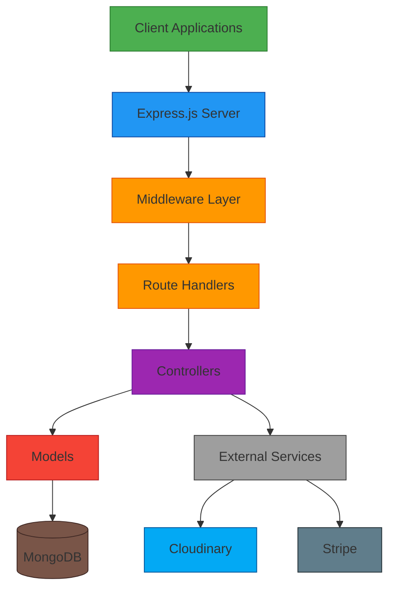
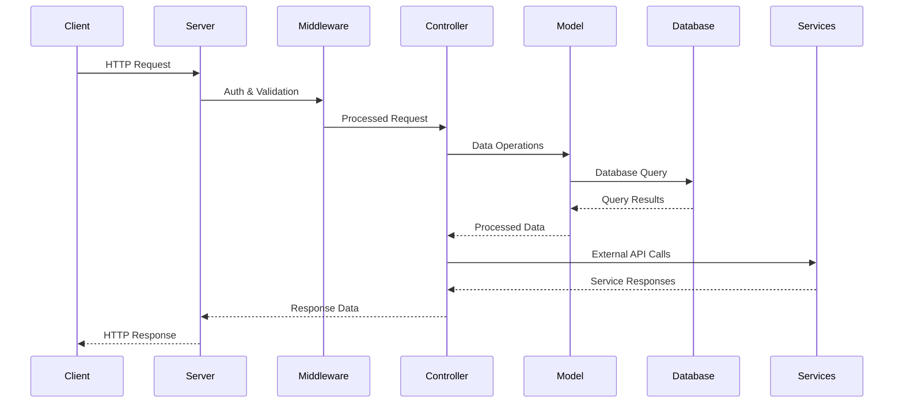
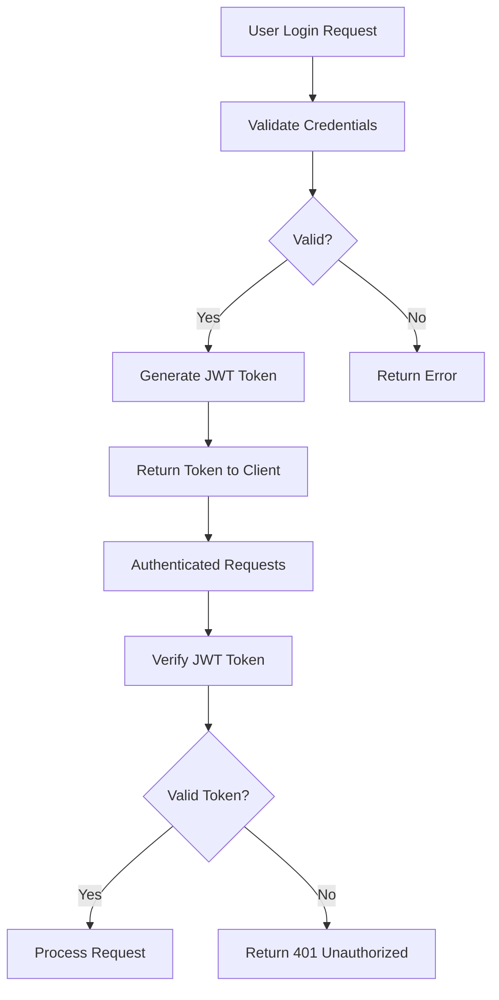

# ⚙️ Backend API - Trendify E-Commerce

<div align="center">
  


</div>

<div align="center">
  
</div>

<p align="center">RESTful API server for the Trendify e-commerce platform built with Node.js, Express, and MongoDB.</p>

---

## 📋 Overview

The Backend API serves as the core of the Trendify e-commerce platform, handling all business logic, data persistence, and external service integrations. It provides secure authentication, product management, order processing, and payment handling.

<div align="center">
  
</div>

---

## 🏗️ Architecture

### System Components



### Data Flow



---

## 🔐 Authentication Flow



---

## 🚀 Key Features

### 🔐 Security
- **JWT Authentication**: Secure token-based authentication
- **Password Encryption**: bcrypt hashing for user passwords
- **Input Validation**: Sanitization and validation of all inputs
- **CORS Protection**: Controlled cross-origin resource sharing

### 🛒 E-Commerce Functionality
- **Product Management**: CRUD operations for products
- **Shopping Cart**: Persistent cart management
- **Order Processing**: Complete order lifecycle management
- **User Management**: Registration, authentication, and profiles

### ☁️ External Integrations
- **Cloudinary**: Image storage and management
- **Stripe**: Payment processing
- **MongoDB Atlas**: Cloud database hosting

---

## 🛠️ Tech Stack

| Technology | Purpose |
|------------|---------|
| **Node.js** | JavaScript runtime environment |
| **Express.js** | Web framework for RESTful APIs |
| **MongoDB** | NoSQL database for data storage |
| **Mongoose** | ODM for MongoDB interactions |
| **JWT** | Token-based authentication |
| **Bcrypt** | Password hashing |
| **Cloudinary** | Image management service |
| **Stripe** | Payment processing |
| **Multer** | File upload handling |
| **Cors** | Cross-origin resource sharing |

---

## 📁 Project Structure

```
backend/
├── config/              # Configuration files
│   ├── cloudinary.js    # Cloudinary setup
│   └── mongodb.js       # MongoDB connection
├── controllers/         # Business logic
│   ├── cartController.js
│   ├── orderController.js
│   ├── productController.js
│   └── userController.js
├── middleware/          # Request processing
│   ├── adminAuth.js
│   ├── auth.js
│   └── multer.js
├── models/              # Database models
│   ├── orderModel.js
│   ├── productModel.js
│   └── userModel.js
├── routes/              # API endpoints
│   ├── cartRoute.js
│   ├── orderRoute.js
│   ├── productRoute.js
│   └── userRoute.js
├── server.js            # Application entry point
├── package.json         # Dependencies and scripts
└── .env                 # Environment variables
```

---

## ▶️ Getting Started

### Prerequisites
- Node.js (v16 or higher)
- MongoDB database (local or Atlas)
- Cloudinary account
- Stripe account

### Installation

```bash
# Navigate to backend directory
cd backend

# Install dependencies
npm install
```

### Development

```bash
# Start development server with nodemon
npm run server
# Runs on http://localhost:4000
```

### Production

```bash
# Start production server
npm start
```

---

## 🌐 Environment Variables

Create a `.env` file in the backend directory:

| Variable | Description | Example |
|----------|-------------|---------|
| `PORT` | Server port | `4000` |
| `MONGODB_URI` | MongoDB connection string | `mongodb+srv://...` |
| `CLOUDINARY_CLOUD_NAME` | Cloudinary cloud name | `your_cloud_name` |
| `CLOUDINARY_API_KEY` | Cloudinary API key | `123456789012345` |
| `CLOUDINARY_SECRET_KEY` | Cloudinary secret key | `abcdefghijklmnopqrstuvwxyz` |
| `JWT_SECRET` | Secret for JWT token generation | `your_jwt_secret` |
| `ADMIN_EMAIL` | Default admin email | `admin@trendify.com` |
| `ADMIN_PASSWORD` | Default admin password | `admin@123` |

---

## 🔄 API Endpoints

### Authentication
| Method | Endpoint | Description |
|--------|----------|-------------|
| `POST` | `/api/user/register` | Register new user |
| `POST` | `/api/user/login` | User login |
| `POST` | `/api/user/admin` | Admin login |

### Products
| Method | Endpoint | Description |
|--------|----------|-------------|
| `POST` | `/api/product/add` | Add new product |
| `GET` | `/api/product/list` | Get all products |
| `POST` | `/api/product/remove` | Remove product |
| `POST` | `/api/product/single` | Get single product |

### Cart
| Method | Endpoint | Description |
|--------|----------|-------------|
| `POST` | `/api/cart/add` | Add item to cart |
| `POST` | `/api/cart/remove` | Remove item from cart |
| `POST` | `/api/cart/get` | Get user cart |

### Orders
| Method | Endpoint | Description |
|--------|----------|-------------|
| `POST` | `/api/order/place` | Place new order |
| `POST` | `/api/order/list` | Get user orders |
| `POST` | `/api/order/admin` | Get all orders (admin) |
| `POST` | `/api/order/status` | Update order status |

---

## 🤝 Contributing

1. Fork the repository
2. Create your feature branch (`git checkout -b feature/AmazingFeature`)
3. Commit your changes (`git commit -m 'Add some AmazingFeature'`)
4. Push to the branch (`git push origin feature/AmazingFeature`)
5. Open a Pull Request

---

## 📄 License

This project is licensed under the MIT License - see the [LICENSE](../LICENSE) file for details.