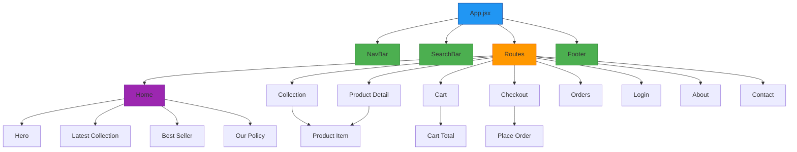
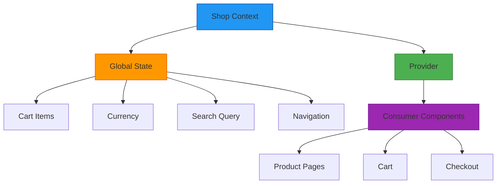

# 🛍️ Frontend Store - Trendify E-Commerce

<div align="center">
  


</div>

<div align="center">
  
</div>

<p align="center">Customer-facing storefront for the Trendify e-commerce platform built with React, Vite, and Tailwind CSS.</p>

---

## 📋 Overview

The Frontend Store is the customer-facing interface of the Trendify e-commerce platform. It provides a seamless shopping experience with product browsing, cart management, secure checkout, and order tracking.

<div align="center">
  
</div>

---

## 🏗️ Architecture

### Component Structure



### State Management



---

## 🚀 Key Features

### 🛍️ Shopping Experience
- **Product Catalog**: Browse thousands of products with filtering and sorting
- **Product Search**: Instant search with autocomplete functionality
- **Product Details**: Comprehensive product information with images
- **Wishlist**: Save favorite items for later

### 🛒 Cart & Checkout
- **Shopping Cart**: Add/remove items, adjust quantities
- **Cart Persistence**: Cart saved between sessions
- **Secure Checkout**: Multi-step checkout process
- **Multiple Payments**: Stripe-integrated payment options

### 👤 User Features
- **User Accounts**: Registration and login
- **Order History**: View past orders and tracking information
- **Profile Management**: Update personal information

### 📱 Responsive Design
- **Mobile-First**: Optimized for all device sizes
- **Touch Friendly**: Intuitive touch interactions
- **Fast Loading**: Optimized performance with Vite

---

## 🛠️ Tech Stack

| Technology | Purpose |
|------------|---------|
| **React** | Frontend library for building UI components |
| **Vite** | Build tool for fast development and production builds |
| **Tailwind CSS** | Utility-first CSS framework for styling |
| **React Router** | Navigation and routing |
| **React Context** | State management |
| **Axios** | HTTP client for API requests |
| **React Toastify** | Notification system |

---

## 📁 Project Structure

```
frontend/
├── src/
│   ├── assets/             # Images and static assets
│   ├── components/         # Reusable UI components
│   │   ├── BestSeller.jsx
│   │   ├── CartTotal.jsx
│   │   ├── Footer.jsx
│   │   ├── Hero.jsx
│   │   ├── LatestCollection.jsx
│   │   ├── NavBar.jsx
│   │   ├── NewsLetterBox.jsx
│   │   ├── OurPolicy.jsx
│   │   ├── ProductItem.jsx
│   │   ├── RelatedProducts.jsx
│   │   ├── SearchBar.jsx
│   │   └── Title.jsx
│   ├── context/            # React context providers
│   │   └── ShopContext.jsx
│   ├── pages/              # Main page components
│   │   ├── About.jsx
│   │   ├── Cart.jsx
│   │   ├── Collection.jsx
│   │   ├── Contact.jsx
│   │   ├── Home.jsx
│   │   ├── Login.jsx
│   │   ├── Orders.jsx
│   │   ├── PlaceOrder.jsx
│   │   ├── Product.jsx
│   │   └── Verify.jsx
│   ├── App.jsx             # Main application component
│   ├── main.jsx            # Entry point
│   └── index.css           # Global styles
├── public/                 # Static assets
├── index.html              # HTML template
├── package.json            # Dependencies and scripts
└── vite.config.js          # Vite configuration
```

---

## ▶️ Getting Started

### Prerequisites
- Node.js (v16 or higher)
- npm or yarn

### Installation

```bash
# Navigate to frontend directory
cd frontend

# Install dependencies
npm install
```

### Development

```bash
# Start development server
npm run dev
# Runs on http://localhost:5173
```

### Production Build

```bash
# Create production build
npm run build

# Preview production build
npm run preview
```

---

## 🌐 Environment Variables

Create a `.env` file in the frontend directory:

```env
VITE_BACKEND_URL=http://localhost:4000
```

---

## 🔄 API Integration

The frontend communicates with the backend API for all data operations:

| Endpoint | Method | Purpose |
|----------|--------|---------|
| `/api/user/register` | POST | User registration |
| `/api/user/login` | POST | User login |
| `/api/product/list` | GET | Retrieve all products |
| `/api/product/single` | POST | Retrieve single product |
| `/api/cart/add` | POST | Add item to cart |
| `/api/cart/get` | POST | Get user cart |
| `/api/order/place` | POST | Place new order |
| `/api/order/list` | POST | Retrieve user orders |

---

## 🤝 Contributing

1. Fork the repository
2. Create your feature branch (`git checkout -b feature/AmazingFeature`)
3. Commit your changes (`git commit -m 'Add some AmazingFeature'`)
4. Push to the branch (`git push origin feature/AmazingFeature`)
5. Open a Pull Request

---

## 📄 License

This project is licensed under the MIT License - see the [LICENSE](../LICENSE) file for details.